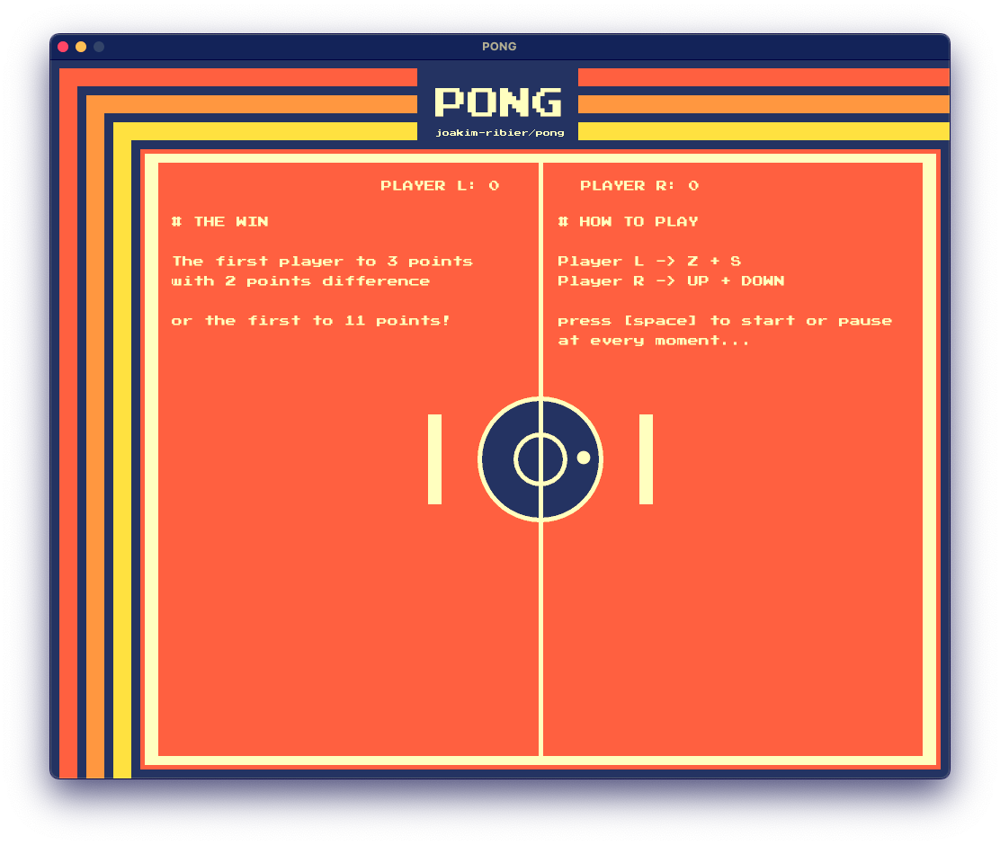

# PONG

The first game `Pong` was developped by Atari in 1972.



[Usage](#usage) - [Releases](#releases) - [License](#license)

## Usage

```bash
# install the latest version
$ go install -v github.com/joakim-ribier/pong/cmd/client@latest

$ client
```

## Releases

### latest

* [x] Implement a `Pong` game (Player L VS Player R) with [`ebitengine`](https://ebitengine.org/) 2D engine
* [ ] Implement a new `web socket` version to play on the network

## License

This software is licensed under the MIT license, see [License](https://github.com/joakim-ribier/pong/blob/main/LICENSE) for more information.